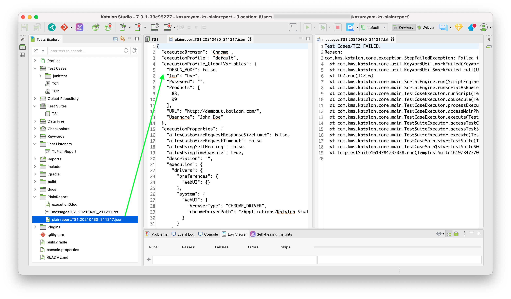

kazurayam-ks-plainreport
========

This is a small [Katalon Studio](https://www.katalon.com/download/) project for demonstration purpose.
You can download a zip file of the project from [Releases](https://github.com/kazurayam/kazurayam-ks-plainreport/releases) page, unzip it, open it with your local Katalon Studio.

The latest version of this project is 0.6.

This project was developed using Katalon Studio version 7.9.1 but it will run with any version above 7.0.

# Problem to solve

In the Katalon User Forum, there was a [question](https://forum.katalon.com/t/get-results-html-path-filename-through-code/50526) that asked how to automatically copy the Test Reports in HTML/PDF format to another location once a test suite finished. In response to the question, I replied with a [post](https://forum.katalon.com/t/get-results-html-path-filename-through-code/50526/5)
where I described my previous solution. To be honest, I am not very much happy with my previous solution. Russ Thomas replied a [post](https://forum.katalon.com/t/get-results-html-path-filename-through-code/50526/3) where he mentioned that, instead of bothering around the built-in Reports, he developed his own reporting functionality. 

So I was motivated to seek for what custom report I can develop in Katalon Studio.

# Solution

Katalon Studio provides a feature called [Test Listeners](https://docs.katalon.com/katalon-studio/docs/fixtures-listeners.html#test-listeners-test-hooks). If you make full use of the TestListener feature, you can compile your own reports of test execution with full control over contents/location/timing. You can compile report in any format you like. You can save the file wherever you want.

I have made a skeletal implementation of my custom Test Report. The report is in JSON text format. It is plain; I mean the report is not ornamented at all.

I have produced a jar file named `kazurayam-ks-plainreport-x.x.x.jar` for general use. You can download and use it in your own Katalon project.

I used the [Gson](https://github.com/google/gson) library to *jsonize* anonymous Groovy objects. Gson is bundled in Katalon Studio.

# Description

## How to install the plugin

- create your own Katalon Studio project
- visit the [Releases](https://github.com/kazurayam/kazurayam-ks-plainreport/releases) page and download the latest version of kazurayam-ks-plainreport-x.x.x.jar`
- save the downloaded jar file into your project's `Plugins` folder
- stop/restart Katalon Studio

## Add a Test Listener

- In the `Test Listener` directory, create a new Test Listenner with any name.
- Copy the sample code [Test Listeners/TLPlainReport](Test%20Listeners/TLPlainReport.groovy) and paste it into you new Test Listener, save it to disk.
- The `TLPlainReport` is common to every case. No code editing is required.

This new Test Listener is required.

## Create your Test Cases and Test Suite.

You can create your Test Cases and Test Suite as you like.

For demo purpose, you can reuse the following test cases as example.
- [Test Cases/TC1](Scripts/TC1/Script1608774761027.groovy)
- [Test Cases/TC2](Scripts/TC2/Script1608774808886.groovy)

Here I assume you will create a Test Suite named "TS1" which binds the TC1 and TC2.

## Running the demo

Select the Test Suite "TS1" and run it.

## Demo output

### Output location

Once the `Test Suites/TS1` finished, a new folder `<projectDir>/PlainReport` will be created.
Inside it you will find a 3 files.

- `execution0.log`
- `messages.<TestSuiteID>.<yyyyMMdd_hhmmss>.txt`
- `report.<TestSuiteID>.<yyyyMMdd_hhmmss>.json`

The [`execution0.log`](PlainReport/execution0.log) file is copied from the Reports folder just to for easier reference. In the log file you can find all messages emitted by your tests with a lot of additives including timestamp.

The [`report.TestSuiteID.yyyyMMdd_hhmmss.json`](PlainReport/plainreport.TS1.20210430_211217.json) file contains information from:
- the TestSuiteContext object
- the TestCaseContext objects
- the `execution.properties` file in the `Report` folder

The [`messages.TestSuiteID.yyyyMMdd_hhmmss.txt`](PlainReport/messages.TS1.20210430_211217.txt) file contains the messages emitted by failed Test Cases in Java printStackTrace format.



### Console log

If you look at the console log, you can find output like this:
```
@AfterTestSuite
Reports/20210101_133234/TS1/20210101_133234/execution0.log 30098bytes
Reports/20210101_133234/TS1/20210101_133234/execution0.log.lck 0bytes
Reports/20210101_133234/TS1/20210101_133234/execution.properties 2660bytes
Reports/20210101_133234/TS1/20210101_133234/testCaseBinding 128bytes
```

This message proves that **2 files in the Report folder (`execution.properites` and `execution0.log`) are available at the event of `@AfterTestSuite`.** In these 2 files you can find almost all information out of Katalon Studio how the test suite was configured and how it ran.


## How the demo designed

Please read the source of the project to find how the demo designed.

1. [`Test Listeners/TLPlainReport.groovy`](Test%20Listeners/TLPlainReport.groovy)
2. [`Keywords/com/kazurayam/ks/plainreport/ReportGenerator`](Keywords/com/kazurayam/ks/plainreport/ReportGenerator.groovy)
3. [`Keywords/com/kazurayam/ks/plainreport/PlainReport`](Keywords/com/kazurayam/ks/plainreport/PlainReport.groovy)

## Desired Reporting frameworks ...

In the Katalon Forum, many people have expressed their wishes that they want to view the test reports using their favorites reporting frameworks. For example;

- https://forum.katalon.com/t/does-katalon-support-integration-of-other-reporting-frameworks-such-as-allure-or-extent-report-if-yes-how/6496

Yes, you can develop your code so that it satisfies your requirements by extracting necessary information and feed it to your favorites reporting framework. That is no different from what I have done here.

However, I would remind you that it would involve a lot of effort for you compiling nicely formatted custom report.
