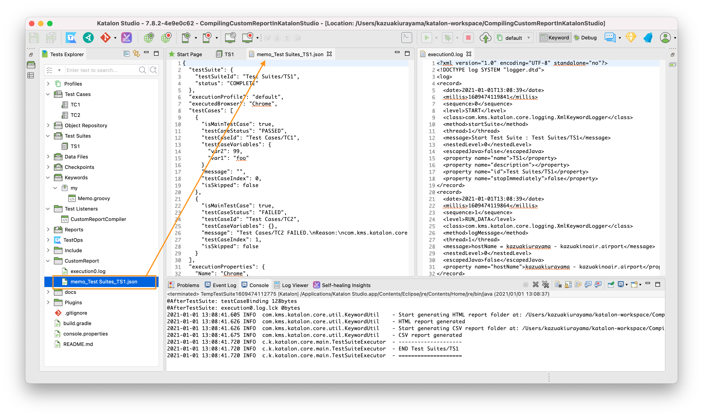

[Katalon Studio] TestListener can compile custom test report --- a skeletal implementation
========

This is a small [Katalon Studio](https://www.katalon.com/download/) project for demonstration purpose.
You can download a zip file of the project from [Releases]() page, unzip it, open it with your local Katalon Studio.

This project was developed using Katalon Studio version 7.8.1 but it will run with any version above 7.0.

# Problem to solve

In the Katalon User Forum, there was a [question](https://forum.katalon.com/t/get-results-html-path-filename-through-code/50526) that
asked how to automatically copy the results to another location at the end of test run.

In response to the question, I replied with a [post](https://forum.katalon.com/t/get-results-html-path-filename-through-code/50526/5)
where I described my previous solution. I am not very much happy with my previous solution.

Russ Thomas replied a [post](https://forum.katalon.com/t/get-results-html-path-filename-through-code/50526/3) where
he mentioned that, instead of bothering around the built-in Reports, he developed his own reporting functionality.
Russ did not described how his code looks like. So, I am afraid, the readers may feel lost where to go 
for developing custom reports as Russ did.

# Solution

Katalon Studio provides [TestListener](https://docs.katalon.com/katalon-studio/docs/fixtures-listeners.html#test-listeners-test-hooks).
If you make full use of the TestListener feature, you can compile your own reports of test execution with full control over
contents/location/timing. You can compile report in any format you like. You can save the file wherever you want.

However, I would remind you that it would invoke a lot of effort compiling your custom report.
 
# Description

## How to run the demo

open the Test Suite `Test Suites/TS1`, and just run it.

## Demo output

Once the `Test Suites/TS1` finished, a new folder `<projectDir>/CustomReport` will be created.
Inside it you will find a 7 JSON files.

Among them, please have a look at the file [`CustomReport/memo_Test Suiites_TS1.json`](CustomReport/memo_Test%20Suites_TS1.json). This JSON file contains a lot of information how the tests ran. It is a satisfactory Custom Report, isn't it?

## How the demo designed

Please read the source of the project to find how the demo designed.

The core part is [`Test Listeners/MyTestListener.groovy`](Test%20Listeners/MyTestListener.groovy). The `MyTestListener` and a custom Groovy class [`my.Memo`](Keywords/my/Memo.groovy) do everything needed to produce the JSON report.

The Test Listener fully controls the process of compiling reports --- contents/location/timing

## Desiring more ...

If you had a glance at [`CustomReport/memo_Test Suiites_TS1.json`](CustomReport/memo_Test%20Suites_TS1.json), soon you will find a lot more. Let me enumerate them:

1. Timestamps are needed. When the Test Suite started/finished. When the Test Cases started/finished.
2. Which browser was used? which os? which version of Katalon Studio? etc
3. Want the report formatted in a nicely styled HTML.

Yes, you can do it. You can develop your code so that it satisfies every single requirements yourself.